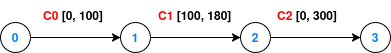

## Bundle Processing

### Run the example

This example requires the `node_proc` feature:
```bash
cargo run --example bundle_processing --features node_proc
```

### Context

The bundle processing feature is exploratory.

The bundle protocol allows features like the addition of extension blocks (EB), as well as bundle in bundle encapsulation (BIBE). If we assume that some concepts can be applied to a bundle along the path, then the size of the bundle may increase or decrease. This assumes that we still want to compute the end-to-end path from the source (also with BIBE) and that we know which nodes will change the bundle size.

For this example, we will consider another hypothetical use case, where a rover (node 0) is not able to apply data compression before sending the bundle and delegate compression to the orbiter (node 1).

Important: mutating a bundle along the path during dijkstra (by changing its size or priority) is quite peculiar and requires cloning the bundle and attaching the mutated copy to a RouteStage. This copy will be further cloned if required downstream. Please note that this memory and computational overhead are absent if this feature is not enabled.

### Implement the node manager for bundle compression

The `NodeManager` trait provides node resource management capabilities for bundle processing when the `node_proc` feature is enabled. Once enabled, this feature requires the implementation of the `dry_run_process` and `schedule_process` methods.

These two methods take a `Date` parameter `at_time` that corresponds to the bundle arrival time at the node. The methods apply the processing by mutating the bundle and returning another `Date` that corresponds to the earliest transmission start time to the next node, after taking the processing delay into account.

In this implementation, we implement a `NodeManager` named `Compressing` that shrinks the bundle size to 3/4 of the original bundle, only if the priority of the bundle does not exceed a certain value called `max_priority`. We therefore implement the parser to retrieve this value from the contact plan.

### Scenario



The network encompasses three nodes: 0, 1, 2, and 3. The only path from node 0 to node 3 passes through nodes 1 and 2. The bundles have an original size of 100 and cannot be transmitted from node 1 to node 2 without compression.

In the first contact plan (contact_plan_1.cp), compression management is not deployed. In the second contact plan (contact_plan_2.cp), a `Compressing` manager is configured for node 1, and a `max_priority` equal to one. The processing delay is arbitrarily set to 2 seconds.

### Behavior

In the first test where the `Compression` manager is not deployed, pathfinding to node 3 will fail.

The next two tests attempt to find paths for two bundles of priority 0 and 2. Pathfinding will succeed for the first bundle and compression is performed at node 1. As long as the second bundle is not eligible for compression, pathfinding will fail.