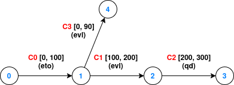

## Earliest Transmission Opportunity

### Run the example

This example requires the `manual_queueing` feature:
```bash
cargo run --example eto_management --features manual_queueing
```

### Context

The Earliest Transmission Opportunity (ETO) feature is part of the SABR standard, and assumes transmission queue access.

The implementation of A-SABR allows reflecting the queue occupancy via callbacks if using ETO. The `ContactManager` interface exposes the `enqueue` and `dequeue` methods if the `manual_queue` feature is enabled. By default, the `enqueue` and `dequeue` methods have no effects unless the behavior is redefined, as is the case of the managers based on ETO like the `ETOManager`.

### Using a proper router

In this example, we build a generic router thanks to the `build_generic_router` helper function.

### Scenario



The network encompasses three nodes: 0, 1, 2, 3, and 4. The contacts C1, and C3 are managed with `EVLManager`, C2 is managed with `QDManager`, and C0 is managed with `ETOManager` (node 0 is the local).

Three bundles of size 20 will be scheduled at t = 15. The first two bundles have node 3 for destination, and the third must reach node 4. The bundles will be scheduled and enqueued one at a time.

### Behavior

It can be observed that the `ETOManager` calculates correctly the queue delay "at real time" : the volume booked for the contact is considered as the current transmission queue occupancy. In opposition, the `QDManager` calculates a delay relative to the contact start time (as shown for C2, with an arrival time at 240 to node 3 for the second bundle). If C0 was managed by `QDManager`, the route for bundle_2 would show an arrival time at node 1 at t=40 (bundle_1 would push the ETO from the start time, so t=20, instead of pushing the start time from 15 to 35).

The bundle_3 can't be scheduled, due to the transmission queue, its arrival time at node 1 would not allow transmission on C3.

We then decide that bundle_1 transmission as terminated (e.g. abortion), it is dequeued, and a scheduling retry is processed for bundle_3, with success.

### Implementation concerns

A downcasting attempt of a `Box<dyn ContactManager>` to an `ETOManager` would render the `manual_queue` feature unnecessary if the `ETOManager` would expose its own `enqueue` and `dequeue` methods.

At the time of writing, a smooth implementation to downcast a `dyn ContactManager` would require nightly features.