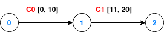

## Satellite Constellation

### Run the example

This example requires the `node_tx` feature:
```bash
cargo run --example satellite_constellation --features node_tx
```

### Context

The Schedule-Aware Bundle Routing standard targets Delay/Disruption-Tolerant Networks (DTNs), inherently supporting bundle retention.

However, in some cases, it may be desirable to disallow retention for specific nodes in the network. For example, in a non DTN satellite constellation, retention might not be needed at all.

### Implement the absence of retention

The `NodeManager` trait provides node resource management capabilities for transmissions when the `node_tx` feature is enabled. Once enabled, this feature requires the implementation of the `dry_run_tx` and `schedule_tx` methods.

These two methods take two `Date` parameters: `waiting_since` and `start`. The former represents the arrival time at the node (including any additional delay if the `node_proc` feature is enabled), while the latter represents the transmission start time to the next node.

Retention is effectively disabled if the delay between the arrival time at the node and the transmission on the next contact does not exceed 200ms.

### Scenario



The network encompasses three nodes: 0, 1, and 2. The only path from node 0 to node 2 passes through node 1. The contacts require a retention time of at least one second at node 1 due to the start and end times of contacts C0 and C1.

In the first contact plan (contact_plan_1.cp), retention is allowed as no constrains are applied for resource management (a `NoManagement` manager is assigned to each node statically). In the second contact plan (contact_plan_2.cp), node 1 is assigned the `NoRetention` manager (dynamically, thanks to the `noret` marker), to disallow message retention at this node. Nodes 0 and 2 remain able to retain bundles (`NoManagement` managers indicated the `none` marker).

### Behavior

As long as avoiding retention on the path to node 2 is impossible. Pathfinding using with a `NoRetention` manager on node 1 shall fail to find a route to node 2.